# Climbing Data Analysis

## Where are the best places to live for rock climbing?

  
<b>All Climbing Disciplines</b>

  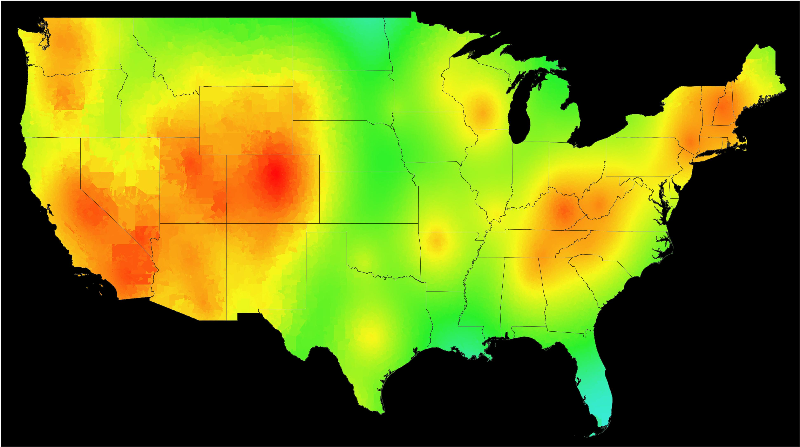

 

  
<b>Sport</b>

  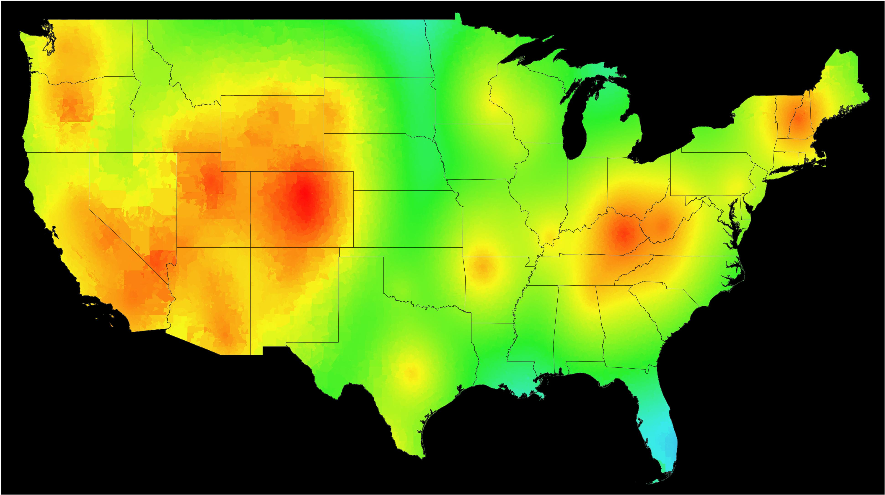

 

  
<b>Bouldering</b>

  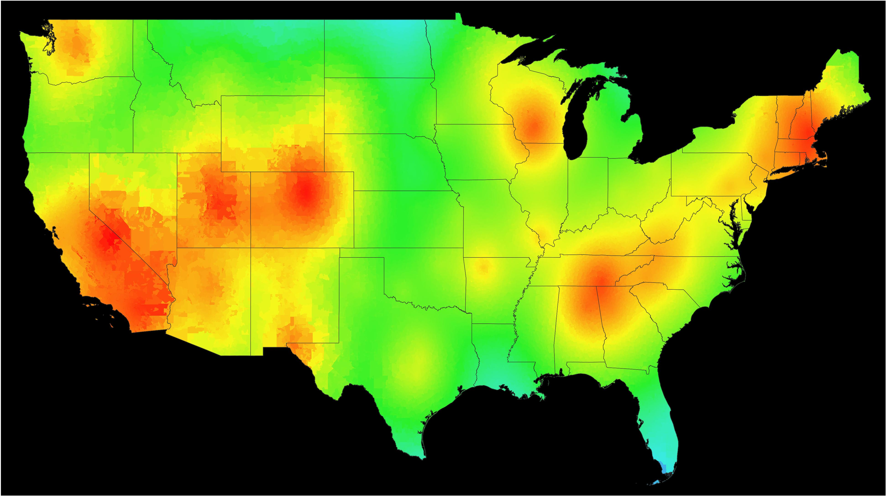

 

  
<b>Trad</b>

  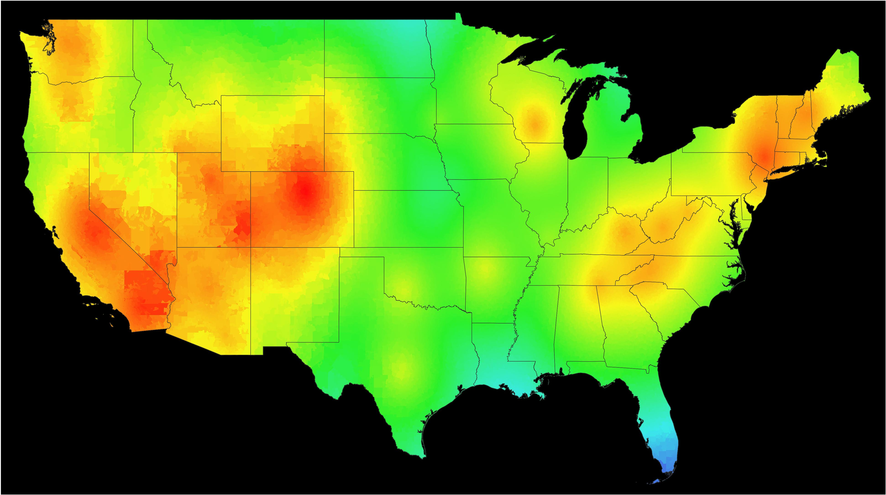

 

  
<b>Toprope</b>

  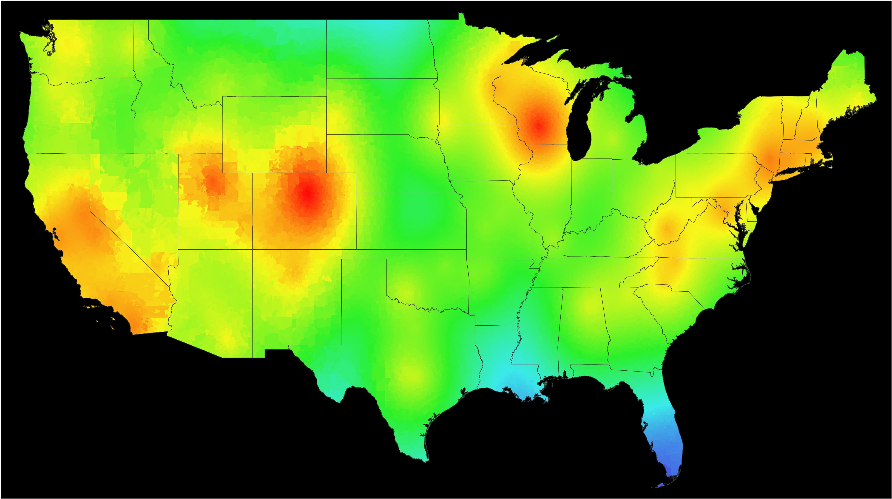

 

  
<b>Aid</b>

  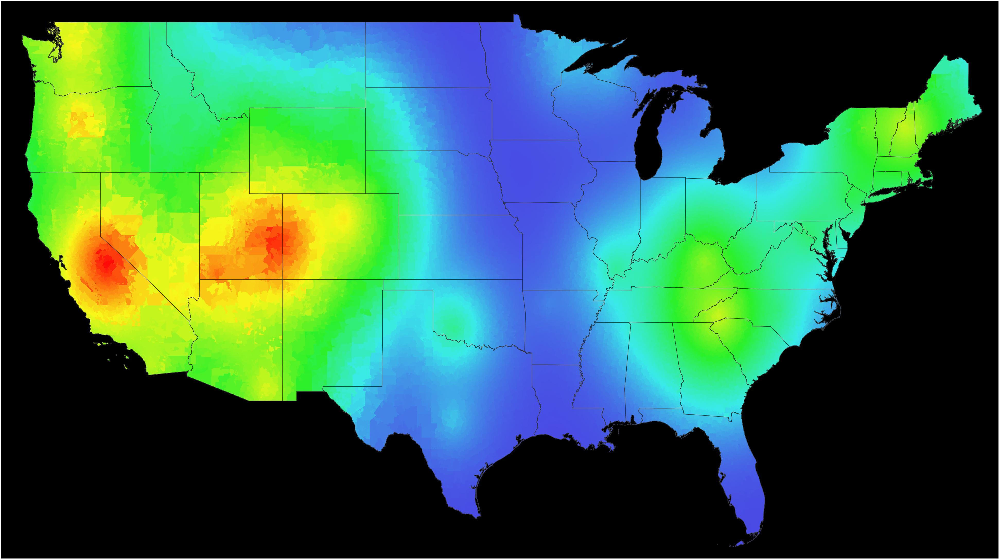

 

  
<b>Alpine</b>

  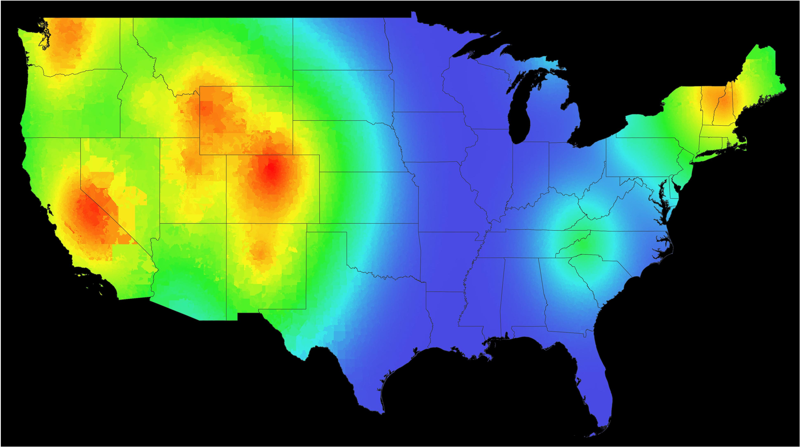

 

  
<b>Snow</b>

  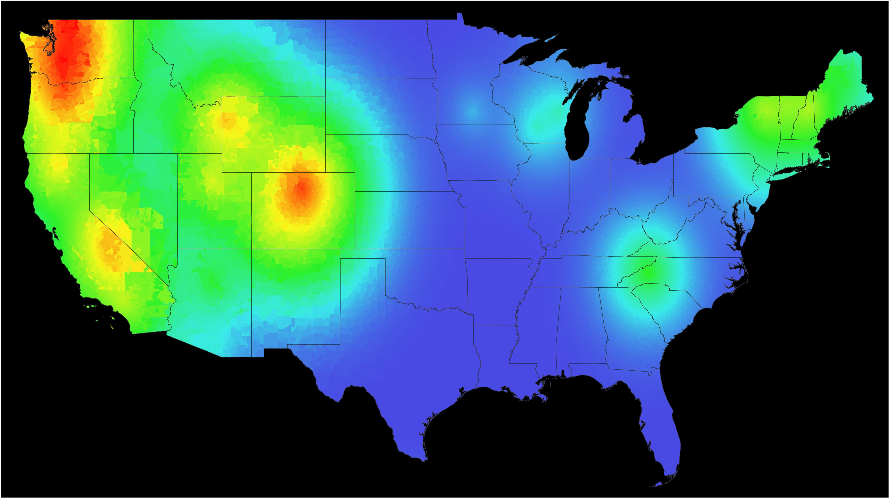

 

  
<b>Ice</b>

  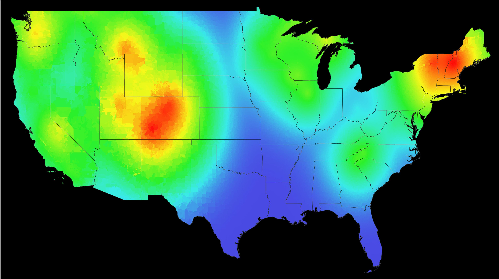

 

  
<b>Mixed</b>

  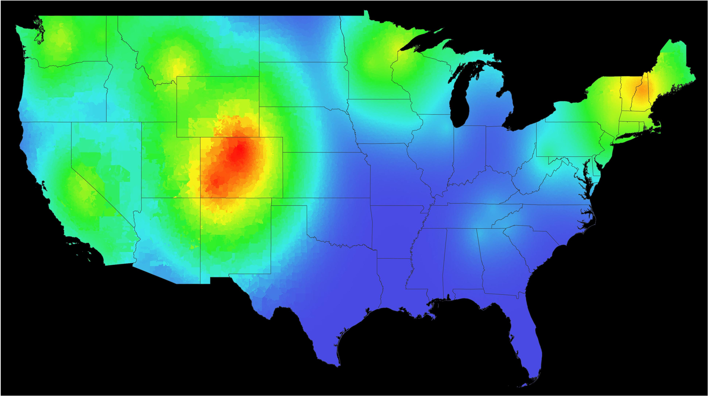

 

## How are these heatmaps created?

For every zipcode in the United States, we calculate that zipcode's climbing score using the following formula.

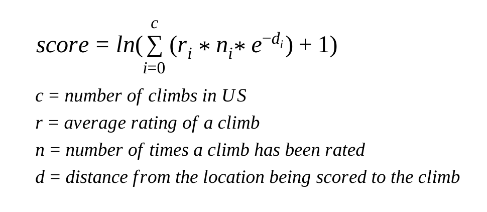

After creating [a score for each zipcode](./data/geo-scores), we then create the heatmap using Matplotlib in conjunction with shapefiles provided by the 2017 US Census.

Since [not every area in the US is covered by a zipcode](https://www.reddit.com/r/MapPorn/comments/938z9e/map_of_us_zip_code_regions/), we use US counties as a fallback which are less granular than zipcodes but cover all areas in the US.

## Datasets

- [2017 US Census Zipcode Shapefiles](https://www.census.gov/geo/maps-data/data/cbf/cbf_counties.html)
- [2017 US Census County Shapefiles](https://www.census.gov/geo/maps-data/data/cbf/cbf_counties.html)
- [2017 US Census State Shapefiles](https://www.census.gov/geo/maps-data/data/cbf/cbf_counties.html)
- [2017 US Census Zipcode Latitude and Longitude](https://gist.github.com/erichurst/7882666)
- [2017 US Census County Latitude and Longitude](https://www.census.gov/geo/maps-data/data/gazetteer2017.html)
- [Rock Climbing Data](https://github.com/alexcrist/mountain-project-scraper)
